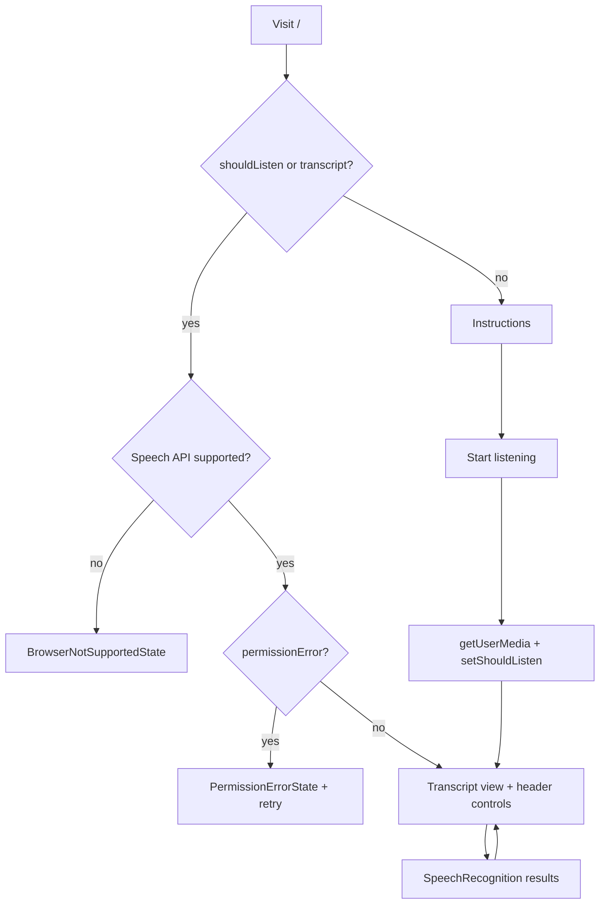

# Aid.me — Product specification

Authoritative product overview, current application state, and roadmap.  
Agent instructions: see [AGENTS.md](./AGENTS.md). Human setup: see [README.md](./README.md).

---

## 1. Product overview

### Product promise

**Closed captioning for your life** — place a phone or laptop where people are speaking, tap the microphone, and read large real-time captions without accounts, servers, or stored transcripts.

### Target users

- People who are **deaf or hard of hearing** following in-person conversations
- Companions showing captions **face-to-face** across a table
- Anyone needing **live notes** from nearby speech (meetings, classrooms, casual talk)
- Users of the **Aid Hearing** iOS app (WebView wrapper) who want the same web experience

### Core workflows

1. **First visit:** Land on `/` → see instructions → tap mic → grant microphone → transcript view
2. **Return visit:** Tap header mic → listen → read auto-scrolling sentences + interim line
3. **Face-to-face:** On mobile, toggle “Face-to-face” to rotate captions for someone opposite
4. **Help / trust:** Open `/about`, `/privacy`, `/terms` from footer
5. **Native wrapper:** Logo tap sends `ReactNativeWebView.postMessage("refresh")` when embedded

### Product goals

- Maximize **comprehension** (readable type, scroll to latest, stable listening loop)
- Minimize **friction** (no sign-up, one-button listen, clear permission errors)
- Preserve **privacy** (no server storage of speech or transcript)
- Support **accessibility** (ARIA live regions, semantic button states, high contrast)
- Stay **compatible** with Chrome, Edge, Safari and the existing iOS shell

---

## 2. Current application state

*Verified against codebase on branch `dev` (merged with `origin/main`). Items marked **(inferred)** are not explicitly documented in code comments.*

### What the app does

Single-page transcription experience at `/` with global header (mic, logo, help). Speech is captured in-browser, converted to text via `SpeechRecognition`, displayed as capitalized sentences with a trailing period, with interim partial text below. Listening stops automatically after 30 minutes or when the user toggles the mic off.

### Feature inventory

| Feature | Status | Implementation notes |
|---------|--------|----------------------|
| Continuous speech recognition | Shipped | `useListening` + singleton in `speechRecognition.ts` |
| Interim results | Shipped | Separate `interimTranscript` state |
| Auto-restart after `onend` | Shipped | 250ms delay; guarded by mount + `shouldListen` |
| Transcript cap (200 sentences) | Shipped | `MAX_TRANSCRIPT_LENGTH` |
| Instructions onboarding | Shipped | Shown when `!shouldListen && transcript.length === 0` |
| Unsupported browser UI | Shipped | `BrowserNotSupportedState` |
| Permission denied / retry | Shipped | `PermissionErrorState`, toasts from header |
| Network / service errors | Shipped | `ERROR_MESSAGES.NETWORK_ERROR` |
| Face-to-face flip (mobile) | Shipped | Zustand `isTranscriptFlipped`, `lg:hidden` toggle |
| Desktop auto-unflip | Shipped | `useMediaQuery` resets flip at `lg` |
| Auto-scroll transcript | Shipped | `scrollIntoView` on transcript changes |
| Listening timeout 30 min | Shipped | `Header` `useEffect` |
| Toast notifications | Shipped | Sonner in root layout |
| Error boundary | Shipped | `ErrorBoundary` in layout |
| PWA manifest | Shipped | `public/manifest.json` |
| iOS / Android app links | Shipped | `public/.well-known/*` |
| React Native refresh bridge | Shipped | Logo click → `postMessage("refresh")` |
| Language selection UI | **Shipped** | `LanguageSelect` + persisted `recognitionLanguage` in Zustand |
| Transcript copy to clipboard | **Shipped** | `CopyTranscriptButton` + `lib/transcript.ts` |
| Transcript persistence | **Not shipped** | In-memory only; refresh clears |
| User accounts / sync | **Not shipped** | By design |
| Firefox transcription | **Not supported** | No Web Speech API |
| Automated tests | **Partial** | Vitest for lib validation, speech module, route model |

### Current user flows (diagram)

### Integrations

| Integration | Role |
|-------------|------|
| Web Speech API | Core transcription (browser/vendor dependent) |
| Permissions API | Microphone status when available |
| `getUserMedia` | Explicit mic permission before listen |
| Sonner | Error toasts |
| Next.js / Vercel **(inferred deploy)** | Static app hosting; no custom server code in repo |
| Aid Hearing iOS app | WebView + universal links |

### Architecture summary

- **Frontend-only** Next.js 16 App Router SPA-like home page
- **Zustand** for listen toggle + flip preference (partial persist)
- **Hook layer** separates permissions (`useMicrophonePermission`), controls (`useStartListening`), and recognition (`useListening`)
- **No** API routes, Server Actions, database, auth middleware, or background jobs

### Technical constraints

- Requires browser with `SpeechRecognition` / `webkitSpeechRecognition`
- HTTPS (or localhost) typically required for microphone **(inferred from platform norms)**
- Recognition quality and cloud vs on-device processing depend on **browser vendor**, not Aid.me
- `viewport` meta disables user scaling (`maximumScale: 1`)—accessibility tradeoff for layout stability
- Node 22.x enforced via `engines`

### Known limitations

- Transcript lost on full page reload
- Firefox and other non-Web Speech browsers cannot transcribe
- Brief pauses between utterances while recognition restarts
- Browser may not support every listed language tag (user sees language error)
- Transcript list keys use array index **(inferred:** rare reorder issues if cap logic changes)
- Legal pages show `COMPANY_INFO.updatedAt` of November 2023—may be stale relative to product
- README dependency table can drift from `package.json` **(inferred documentation debt)**

### Partially implemented / abandoned systems

- **None identified** as half-built backends or auth.

---

## 3. Product roadmap

Ordered by user impact and dependency. Each item is sized for **one focused commit sequence** on `dev`.

### R1 — Recognition language picker ✅

**Status:** Completed (dev, 2026-05-26)

**User value:** Non–English speakers and bilingual households can use captions in their language.

**Acceptance criteria:**

- [x] User can choose a BCP 47 language (e.g. `en-US`, `es-ES`) from a simple control on the transcript or settings area
- [x] Choice persists across sessions (Zustand `partialize` + Zod schema update)
- [x] `useListening` receives the selected language; recognition restarts cleanly on change

**Implementation note:** Added `recognitionLanguage` to Zustand (persisted), `recognitionLanguageSchema` / `RECOGNITION_LANGUAGES` in constants, `LanguageSelect` on transcript header and onboarding, `language-not-supported` error handling, and validation tests.

---

### R2 — Copy transcript to clipboard ✅

**Status:** Completed (dev, 2026-05-26)

**User value:** Users can save or share what they heard without retyping.

**Acceptance criteria:**

- [x] One control copies full transcript (final sentences + optional interim) to clipboard
- [x] Success/failure feedback via Sonner toast
- [x] Works on supported desktop/mobile browsers; graceful message if `navigator.clipboard` unavailable

**Implementation note:** Added `lib/transcript.ts` (format, clipboard API + `execCommand` fallback), `CopyTranscriptButton` in `TranscriptHeader`, `COPY_MESSAGES` toasts, Vitest coverage.

---

### R3 — Adjustable caption text size

**User value:** Low vision users can read captions comfortably at distance.

**Acceptance criteria:**

- At least three sizes (e.g. default / large / extra-large) affecting transcript and interim text
- Preference persisted in Zustand like flip mode
- Layout remains usable on small phones without horizontal scroll

**Implementation intent:** Store `captionSize` enum; map to Tailwind text classes on `TranscriptDisplay` wrapper.

---

### R4 — Keyboard shortcut for mic toggle

**User value:** Faster control for power users and assistive tech workflows.

**Acceptance criteria:**

- Documented shortcut (e.g. Space when focus not in input) toggles listen via existing `toggleListening`
- Shortcut ignored when focus is in form fields **(inferred)**
- No conflict with browser defaults on `/`

**Implementation intent:** `useEffect` in `Header` or small `useKeyboardListen` hook; `aria-keyshortcuts` on mic button.

---

### R5 — Face-to-face mode onboarding hint

**User value:** More users discover rotate mode for table conversations.

**Acceptance criteria:**

- First time on mobile transcript view, brief non-blocking hint points to “Face-to-face” control
- Dismissal stored in `localStorage` (separate key or Zustand persist flag)
- Does not show again after dismiss

**Implementation intent:** Small banner or coach mark in `Listen`; no new dependencies.

---

### R6 — “Unsupported browser” guidance with actionable links

**User value:** Firefox users understand *why* it fails and what to do next (without promising unsupported APIs).

**Acceptance criteria:**

- `BrowserNotSupportedState` names recommended browsers and links to install/open help
- Optional: detect Firefox user agent **(inferred)** for tailored copy
- Does not imply Aid.me can transcribe in Firefox

**Implementation intent:** Copy + links only in `BrowserNotSupportedState.tsx` and `ERROR_MESSAGES`.

---

### R7 — Optional session transcript restore (local only)

**User value:** Accidental refresh does not erase a long conversation.

**Acceptance criteria:**

- Opt-in toggle (off by default) saves transcript array to `sessionStorage` or `localStorage` with clear privacy label
- Clearing mic stop or explicit “Clear transcript” wipes storage
- Documented in UI that data stays on device

**Implementation intent:** Zustand middleware or effect syncing `transcript` from `useListening`—may require lifting transcript to store or export setter; **privacy-first default off**.

---

### R8 — PWA install prompt / offline shell messaging

**User value:** Mobile users install Aid.me like an app; clearer expectations when offline.

**Acceptance criteria:**

- Detect `beforeinstallprompt` where supported and show discrete install CTA **(inferred browser support)**
- When offline after load, show that transcription requires network/service (aligns with network error path)

**Implementation intent:** Client-only banner component; manifest already present.

---

### R9 — Timestamped sentences

**User value:** Users can correlate captions with meeting notes or video review.

**Acceptance criteria:**

- Each final sentence prefixed or suffixed with `HH:MM:SS` local time when finalized
- Toggle to hide timestamps (default on or off—product choice at implementation)

**Implementation intent:** Store `{ text, at }` in state instead of `string[]`; update `TranscriptDisplay` mapping.

---

### R10 — Export transcript as `.txt` download

**User value:** Shareable file for email, records, or accessibility accommodations.

**Acceptance criteria:**

- Download triggers browser file save with sensible filename (`aidme-transcript-YYYY-MM-DD.txt`)
- Includes timestamps if R9 shipped

**Implementation intent:** `Blob` + temporary anchor; depends on R2/R9 optionally.

---

### R1a — Auto-detect browser language for initial picker default

**User value:** First-time users see their device language pre-selected when supported.

**Acceptance criteria:**

- On first visit (no persisted language), default `recognitionLanguage` maps from `navigator.language` when it matches a supported code (or nearest prefix match)
- Persisted user choice always wins over auto-detect

**Implementation intent:** One-time hydration helper in store `onRehydrateStorage` or client effect; no new UI.

---

## Roadmap explicitly deferred (not next milestones)

- Firebase auth, cloud sync, or user accounts (contradicts privacy promise unless redesigned)
- Server-side Whisper for Firefox (large scope; new infrastructure)
- Full test suite as a standalone milestone (add tests alongside features when they prevent regressions on touched code)

---

## Document history

| Source | Disposition |
|--------|-------------|
| `IMPROVEMENTS.md` | Archived quality audit; see pointer file |
| `README.md` “Ideas for Contribution” | Superseded by roadmap above; README links here |
| `CLAUDE.md` | Points to `AGENTS.md` |
